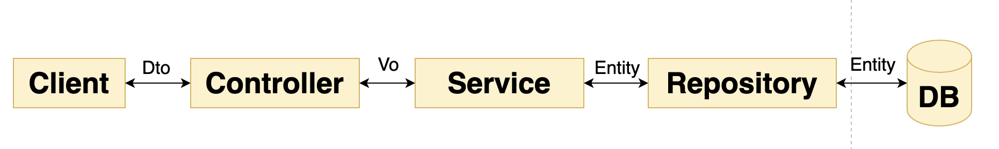

# 이클립스 , gradle 환경 내 QueryDSL 연동하기

**기록 ✍️**

**author : jung yuha**

**first registered : 2022-10-01 Sat**

**last modified : 2022-10-01 Sat**

## **\[1]** build.gradle 수정

#### build.gradle 파일에 다음과 같이 추가한다.

### 1) 의존성 추가

<pre class="language-properties"><code class="lang-properties">buildscript {
    ext {
        queryDslVersion = "5.0.0"
    }
}

<strong>dependencies {
</strong>    implementation "com.querydsl:querydsl-jpa:${queryDslVersion}"
    implementation "com.querydsl:querydsl-apt:${queryDslVersion}"
    //...
}</code></pre>

### 2) 플러그인 추가

구글링을 하다보니 대부분 querydslDir의 경로를 $buildDir이라는 변수를 사용해서 정의하고 있는데 이클립스에서 저렇게 정의하니 Q클래스가 생성되지 않았다.😂

따라서 다음과 같이 $buildDir이라는 변수를 사용하는 대신 'src/main'으로 직접 경로를 작성한다.

<pre class="language-properties"><code class="lang-properties">buildscript {
	dependencies {
		classpath("gradle.plugin.com.ewerk.gradle.plugins:querydsl-plugin:1.0.10")
	}
}

apply plugin: "com.ewerk.gradle.plugins.querydsl"

dependencies {
	//..
	implementation 'com.querydsl:querydsl-jpa'
	implementation 'com.querydsl:querydsl-apt'
}

//querydsl 추가
def querydslDir = "src/main/generated/queryDsl"
querydsl {
   library = "com.querydsl:querydsl-apt"
   jpa = true
   querydslSourcesDir = querydslDir
}
sourceSets {
   main {
      java {
         srcDirs = ['src/main/java', querydslDir]
      }
   }
}
compileQuerydsl{
   options.annotationProcessorPath = configurations.querydsl
}
configurations {
<strong>   querydsl.extendsFrom compileClasspath
</strong>}</code></pre>

## \[2] 컴파일 실행

Gradle tasks의 메뉴에 들어가 **build의 오른쪽 버튼을 클릭해 Run gradle Tasks를** 실행한다.

.png>)

.png>)

**build/generated-sources/querydsl** 밑에 Q로 시작하는 **클래스가 자동생성**된다.\
**이는 각 엔티티에 대한 쿼리 Language를 만들어줄 것이다.**

## \[3] 프로젝트의 build path 설정

### Step1

프로젝트를 우클릭하여  **build Path > Configure Build Path** 를 클릭한다.

<figure><figcaption></figcaption></figure>

### Step2

Configure Build Path 창이 열리면  **Java Build Path > Source 탭에서 Add Folder...** 를 클릭한다.

<figure><figcaption></figcaption></figure>

### step3&#x20;

#### Source Folder 창에서  생성된 Q 클래스가 있는 폴더를 선택한다.

.png>)

## \[4] Q클래스 Import 해결

#### Source Folder 창에서  생성된 Q 클래스가 있는 폴더를 선택까지 마치면 Q 클래스가 있는 'src/main/generated/queryDsl' 폴더가 import 된다.

#### 테스트 코드에 클래스가 잘 생성되는지 확인한다.

 (2).png>)

### &#x20;
