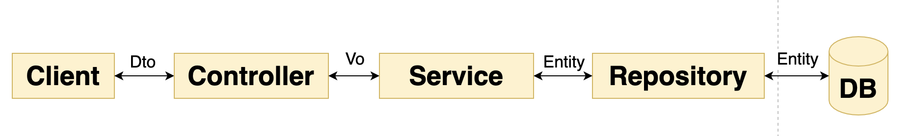

# 스프링 데이터 Common 9. 웹 기능

## \[1] Web이 제공하는 기능

* 도메인 클래스 컨버터를 등록해준다.
  *   request param값으로 들어오는 값들을 도메인으로 변환되어진 파라미터로 받을 수 있다.


      <figure><figcaption></figcaption></figure>
*   @RequestHandler 메소드에서 Pageable과 Sort 를 매개변수로 직접 사용할 수 있다.

    <figure><figcaption></figcaption></figure>
* &#x20;Page 관련 HATEOAS 기능 제공
  * HATEOAS는 하이퍼미디어 정보를 리소스 정보와 같이 사용할 수 있도록 권장하는 구현체이다.
  *   어떠한 리소스를 요청했을 때 그 리소스와 관련이 있는 정보(링크 정보 등..)를 추가로 보내준다.

      <figure><figcaption></figcaption></figure>
  * pageable을 파라미터로 받아서 pagedResourceAssembler를 통해 page를 리소스 형태로 반환할 수 있으며 추가로 링크정보도 같이 보내줄 수 있다.

```java
@GetMapping(“/posts”)
public PageResources<Post> getPosts (Pageable pageable,pagedResourceAssembler assembler){
	Page<Post> all = postRepository.findAll(pageable);
	return assembler.toResource(all);
}
```

* Payload 프로젝션 기능 제공
  * 요청으로 들어오는 데이터(json, xml ..) 중 일부만 바인딩 받아온다.
  * @ProjectedPayload, @XBRead, @JsonPath 어노테이션을 사용한다.
* 요청 쿼리 매개변수를 QueryDSLdml Predicate로 받아온다.
  * **예시**&#x20;
    * **QueryString**이 다음과 같이 들어온 경우 :  **?firstname=Mr\&lastname=White => Predicate**
    *   **QueryDSL의 Predicate가 다음과 같이 받아준다.**

        <figure><figcaption></figcaption></figure>
